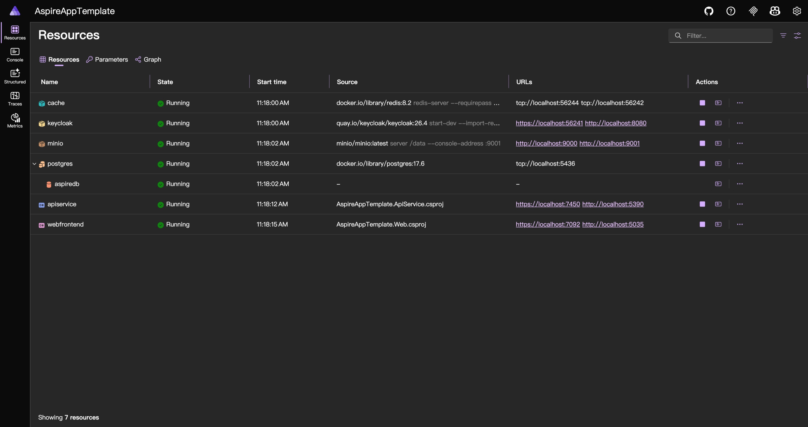
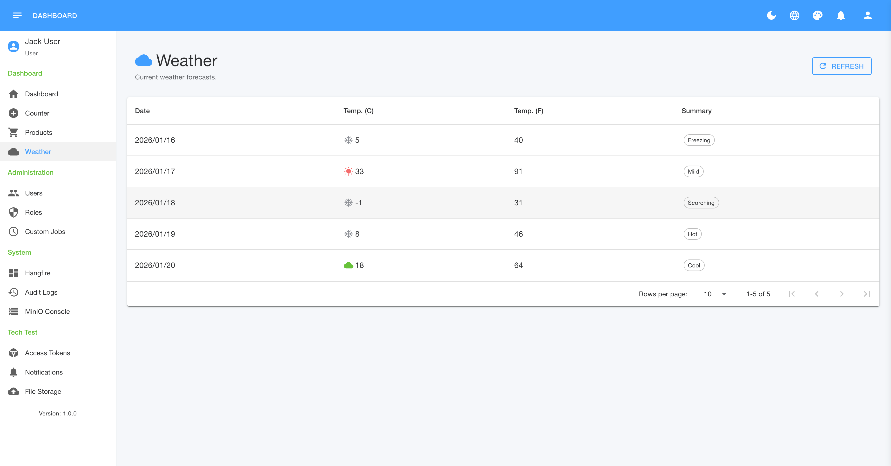

# AspireAppTemplate

[](https://opensource.org/licenses/MIT)

[繁體中文 (Traditional Chinese)](README.zh-TW.md)

## Project Overview

**AspireAppTemplate** is a production-ready microservice template based on **.NET Aspire**, designed for modern cloud-native development. It follows the **KISS (Keep It Simple, Stupid)** principle while providing a complete set of features: Frontend (Blazor), Backend API, Identity (Keycloak), Object Storage (MinIO), Distributed Cache (Redis), and Relational Database (PostgreSQL).

This template serves as a solid starting point for building scalable yet maintainable .NET systems.

## Preview

| .NET Aspire Dashboard | Modern Blazor UI |
| :---: | :---: |
|  |  |

> [!TIP]
> **[Click here to view the full Screenshots Gallery](docs/SCREENSHOTS.md)**

## Key Features

*   **Cloud-Native Orchestration**: Powered by **.NET Aspire** for seamless local development and deployment.
*   **Modern Frontend**:
    *   **Blazor Interactive Server**: High-productivity UI development.
    *   **MudBlazor**: Material Design component library with a custom "Element Plus" inspired theme.
    *   **Theme Manager**: Built-in dark/light mode and color customization.
*   **Vertical Slice Architecture**:
    *   **FastEndpoints**: Backend API using the **REPR Pattern** (Request-Endpoint-Response) for high cohesion.
    *   **No "Clean Architecture" Bloat**: Practical code structure without unnecessary abstraction layers.
*   **Robust Identity Management**:
    *   **Keycloak**: Fully integrated Docker container for OpenID Connect (OIDC) authentication.
    *   **Custom Realm & Theme**: Pre-configured Realm and Theme (`aspire-app-theme`) auto-imported on startup.
*   **Data & Storage**:
    *   **PostgreSQL**: Primary relational database with EF Core.
    *   **MinIO**: S3-compatible object storage for file management.
    *   **Redis**: Distributed caching (OutputCache & Data Cache).
*   **Background Processing**:
    *   **Hangfire**: Integrated background job processing with a persistent PostgreSQL storage and Dashboard.
*   **Observability**:
    *   **OpenTelemetry**: Built-in tracing, metrics, and logging.
    *   **Serilog**: Structured logging for all services.
    *   **Scalar**: Next-gen API documentation UI.

## Project Structure

The project code is consolidated under the `src/` directory:

*   **`src/api/` (Backend)**
    *   `ApiService`: The core API service containing business logic, data access (EF Core), and Hangfire jobs.
*   **`src/web/` (Frontend)**
    *   `Web`: The Blazor Server application.
*   **`src/aspire/` (Orchestration)**
    *   `AppHost`: The Aspire orchestrator that defines containers and dependencies.
    *   `ServiceDefaults`: Shared configurations for health checks and telemetry.
*   **`src/shared/`**
    *   Common DTOs and models shared between Frontend and Backend (minimal coupling).

## Getting Started

### Prerequisites

1.  **[Discord](https://discord.com/)** (Just kidding, but join our community!)
2.  **[.NET 10 SDK](https://dotnet.microsoft.com/download)** (Preview or latest).
3.  **[Docker Desktop](https://www.docker.com/products/docker-desktop)** (Must be running).

### Running the Application

A convenience script is provided in the root directory to jumpstart your environment:

```cmd
run.bat
```

Or using the CLI:

```bash
dotnet run --project src/aspire/AppHost/AspireAppTemplate.AppHost.csproj
```

### What Happens Next?

1.  **Aspire Dashboard**: The browser opens automatically, showing the health of all services (`webfrontend`, `apiservice`, `postgres`, `keycloak`, `minio`, `cache`).
2.  **Database Creation**: `ApiService` automatically creates the `aspiredb` database and applies migrations on startup.
3.  **Keycloak Setup**: Keycloak starts, imports the realm configuration, and is ready to accept logins.

## Service Access & Credentials

Use the following default credentials for local development:

| Service | Url | Username | Password | Notes |
| :--- | :--- | :--- | :--- | :--- |
| **Aspire Dashboard** | Auto-launched | - | - | Central view of all logs/traces. |
| **Web Frontend** | `https://localhost:<port>` | `jack` | `0000` | Test user account. |
| **Keycloak Console** | `http://localhost:8080` | `admin` | `admin` | IAM Administration. |
| **MinIO Console** | `http://localhost:9001` | `minioadmin` | `minioadmin` | S3 Object Storage UI. |
| **PostgreSQL** | `localhost:5436` | `postgres` | `1111` | DB: `aspiredb`. |
| **Hangfire Dashboard** | `/hangfire` (API) | `admin` | - | Requires `Administrator` role. |
| **Scalar (API Docs)** | `/scalar/v1` (API) | - | - | Interactive API Client. |

## Credits & Inspiration

This project is heavily inspired by the [FullStackHero Blazor Starter Kit](https://github.com/fullstackhero/blazor-starter-kit).

**Why another template?**
While the Blazor Starter Kit is an amazing resource, its strict adherence to Clean Architecture can be overwhelming for smaller projects or developers who aren't purely frontend-focused. I wanted to build something simpler—a "wheel" designed for **.NET Aspire** that embraces the **Vertical Slice** pattern. This template aims to provide a more approachable starting point without sacrificing modern cloud-native capabilities.

## Development Guide

### Database
*   **EF Core**: The `DbContext` is located in `src/api/ApiService/Data`.
*   **Port Fixed**: Check `5436` if you want to connect using pgAdmin or Datagrip.

### File Storage (MinIO)
*   The project uses a **Proxy Mode** for file uploads/downloads.
    *   **Frontend** uploads to `ApiService`.
    *   **ApiService** streams to **MinIO** (port 9000).
    *   This avoids Mixed Content issues (HTTPS Web vs HTTP MinIO) and encapsulates storage logic.

### Troubleshooting

**Q: Port 7092/7085 is in use, and Keycloak login fails.**
*   If Aspire assigns a random port (e.g., `7123`) because default ports are busy, Keycloak will reject the redirect URI.
*   **Fix**:
    1.  Open `src/aspire/AppHost/Realms/import-realmdata.json`.
    2.  Add `https://localhost:<new-port>` and `https://localhost:<new-port>/signin-oidc/signout-callback-oidc` to `redirectUris`.
    3.  Restart the Keycloak container (delete the volume to force re-import if needed).

**Q: How to deploy to Production?**
*   Use environment variables to override the Keycloak and API URLs.
*   See `src/aspire/AppHost/AppHost.cs` comments for `KC_HOSTNAME_URL` configuration.