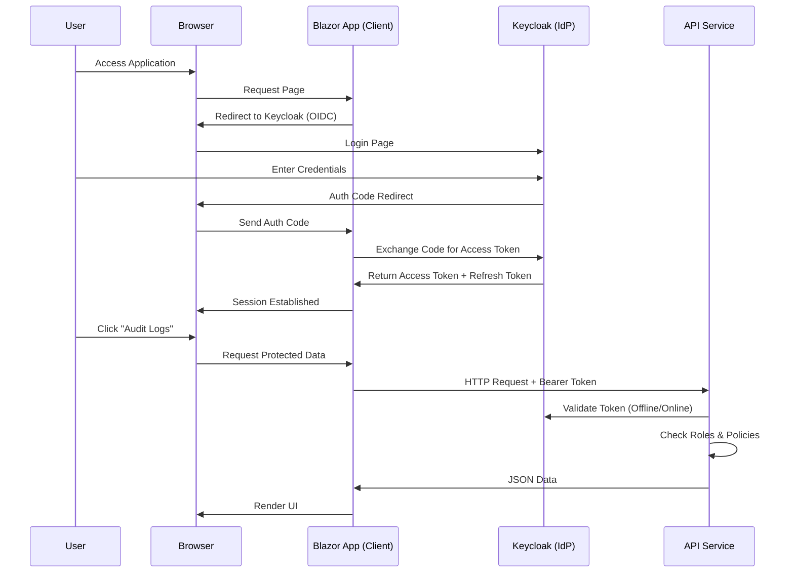

# Keycloak Integration Guide

This guide explains how Keycloak is integrated into the Aspire App Template to provide Identity and Access Management (IAM).

## Overview

The template uses Keycloak as a centralized identity provider for authentication and authorization. It runs as a Docker container managed by .NET Aspire.

### Key Concepts

-   **Realm (`AspireApp`)**: A space where you manage objects, including users, applications, roles, and groups.
-   **Client (`WebApp`)**: The Frontend Application (Blazor) that requests authentication.
-   **Client (`ApiService`)**: The Backend API that validates tokens and requests permissions.
-   **Roles**:
    -   `Administrator`: Full access to the system.
    -   `User`: Standard access.

## Architecture

The following diagram illustrates the authentication flow:

## Configuration

### 1. Aspire Host (`AppHost`)
The `AppHost` spins up the Keycloak container and imports the realm configuration.
-   **File**: `src/aspire/AppHost/AppHost.cs`
-   **Import**: `src/aspire/AppHost/Realms/import-realmdata.json` (Realm configuration snapshot)

### 2. Frontend (`BlazorApp`)
Configured to use OpenID Connect (OIDC) to talk to Keycloak.
-   **File**: `src/web/BlazorApp/Program.cs`
-   **Settings**:
    -   `Realm`: `AspireApp`
    -   `ClientId`: `WebApp`
    -   `Scopes`: `openid`, `profile`, `api:all`, `offline_access`

### 3. Backend (`ApiService`)
Validates JWT tokens issued by Keycloak.
-   **File**: `src/api/ApiService/appsettings.json`
-   **Settings**:
    -   `Realm`: `AspireApp`
    -   `Audience`: `ApiService`

## Pros and Cons

Why use Keycloak?

| Feature | Description |
| :--- | :--- |
| **Centralized Identity** | Manage users, credentials, and roles in one place for all apps (Web, Mobile, API). |
| **Standard Protocols** | Uses standard OIDC and OAuth2, compatible with almost any modern framework. |
| **Single Sign-On (SSO)** | Users log in once and access multiple applications without re-entering credentials. |
| **Social Login** | Easily add Google, Facebook, GitHub, etc., without changing your app code. |
| **Self-Hosted** | Free and open-source, keeps sensitive user data within your infrastructure (vs. Auth0/Okta). |

**Considerations:**
-   **Complexity**: Adds a moving part (another container) to the infrastructure.
-   **Resource Usage**: Java-based, consumes ~500MB+ RAM.
-   **Learning Curve**: Has many features (flows, mappers, policies) that can be overwhelming initially.

## How to Manage Keycloak

1.  **Access Admin Console**:
    -   URL: `http://localhost:8080/admin/`
    -   Username: `admin`
    -   Password: `admin`
2.  **Switch Realm**: Select `AspireApp` and `master` from the dropdown in the top-left corner.
3.  **Manage Users**: Go to **Users** in the left menu to add users or reset passwords.

## Troubleshooting

-   **"401 Unauthorized"**: Check if the Token Audience matches (API expects `ApiService`).
-   **"IDX10500: Signature validation failed"**: Ensure `AppHost` is using HTTP for internal communication or certificates are trusted. Use `https+http://keycloak` in Service Discovery.
