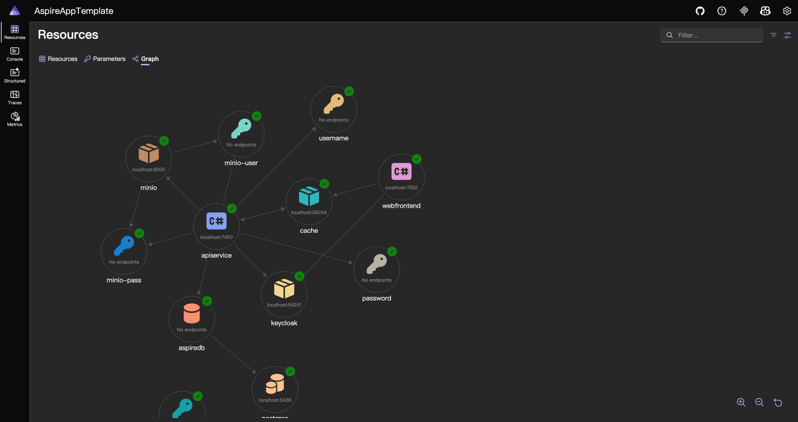
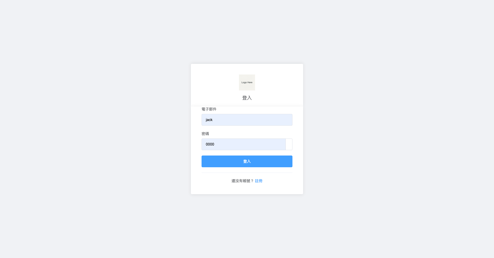
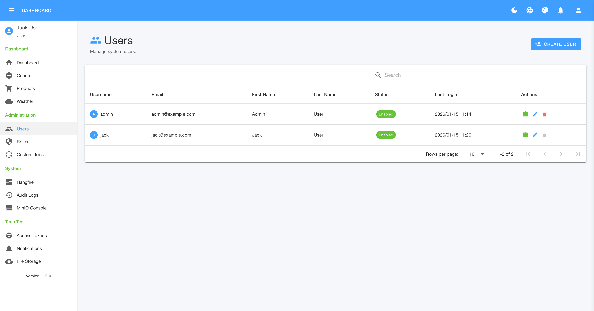
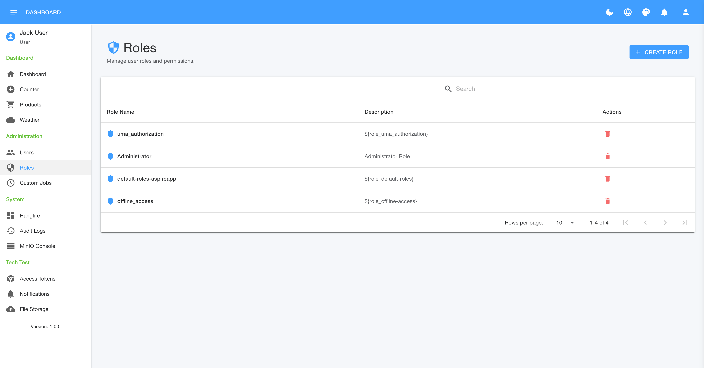
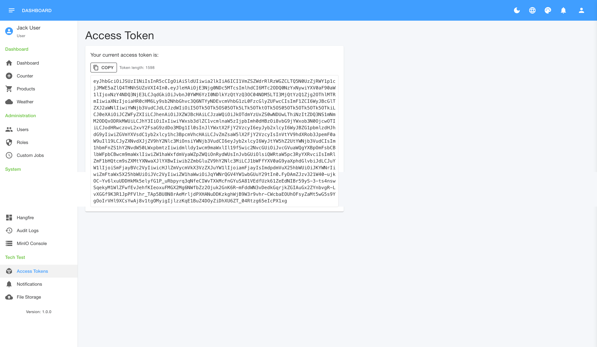
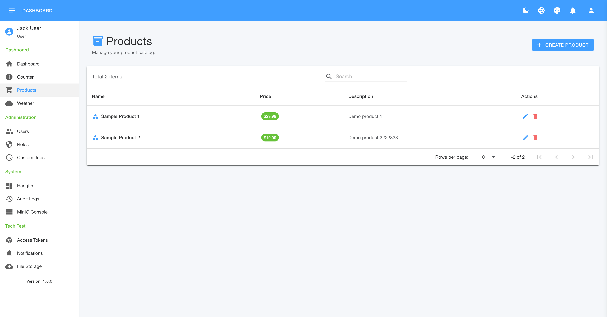
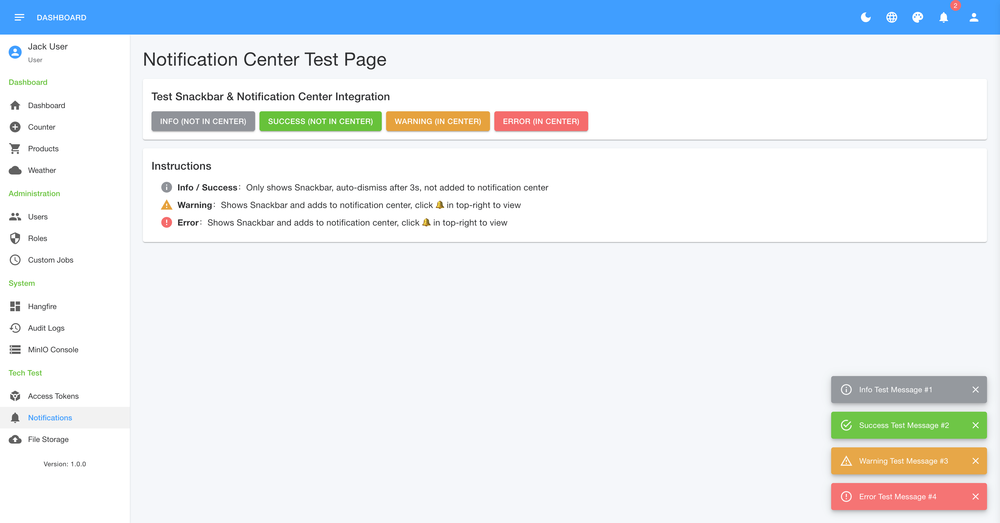
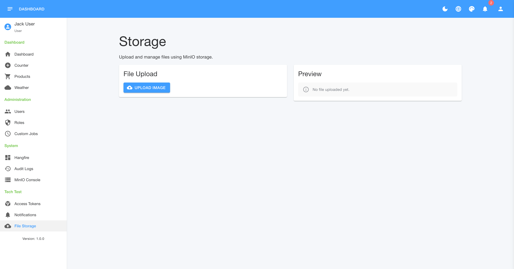
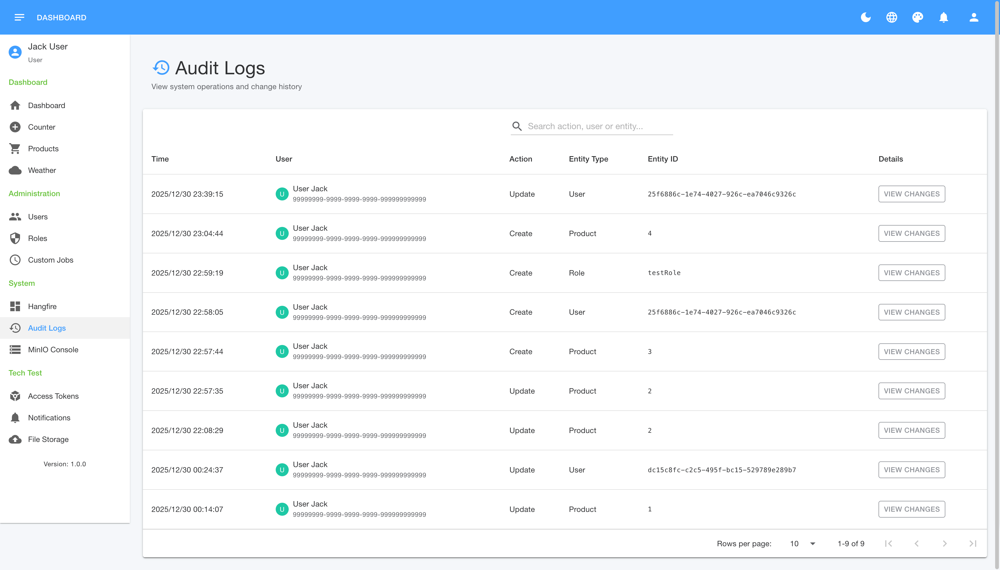

# AspireAppTemplate Gallery

This page showcases the UI and features of the AspireAppTemplate.

## 🚀 Orchestration
### .NET Aspire Dashboard
The central hub for monitoring all services, logs, and traces.

---

## 🔐 Identity & Access
### Custom Keycloak Login
Integrated with specialized theme and OIDC.

### User Management

### Role Management

### Access Tokens

---

## 🎨 Web Frontend (Blazor + MudBlazor)
### Weather Data (API Integration)

### Product Management (CRUD & Database)

### Notifications & UI Elements

---

## 🛠️ System Tools
### File Storage (MinIO Proxy)

### Audit Logs

